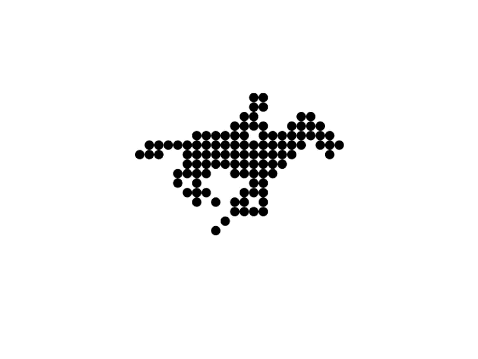

# Welcome to Dot Matrix Docs!

## About

Two Bit's Dot Matrix Shader is a material pack designed to recreate the beautiful, minimal art style of dot matrix visuals. Its core characteristic is the precise placement of dots on a grid. However, this shader goes beyond the traditional style, offering features like custom motifs, randomized colors, animations, and more.

While many similar shaders exist for Unreal Engine 5, what sets ours apart is its ability to target meshes using custom depth, unlocking new creative possibilities.

## Inspiration

This shader was inspired by a striking GIF I found on Pinterest—minimal yet incredibly expressive!

